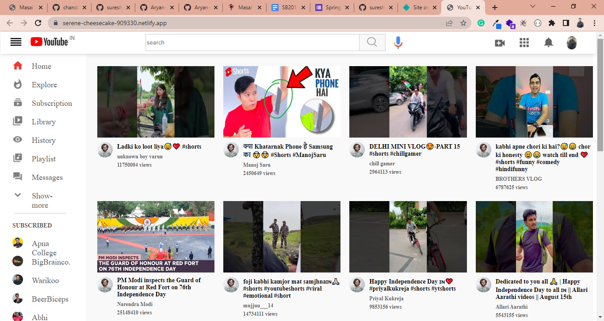
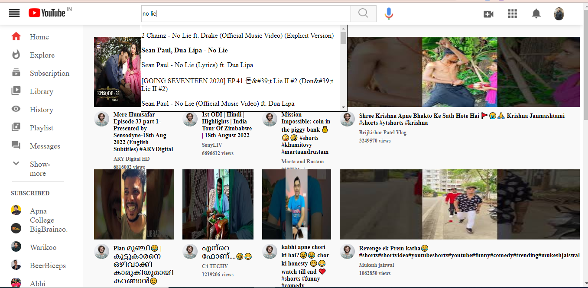
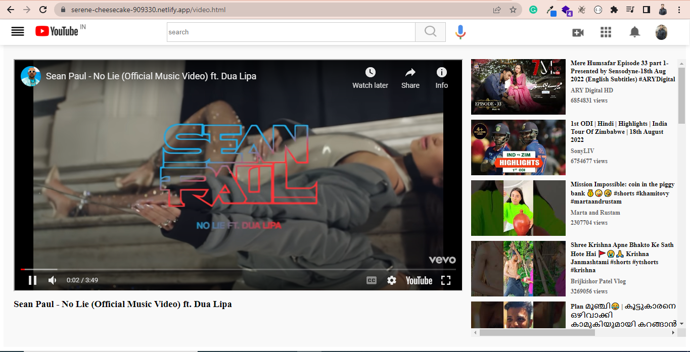
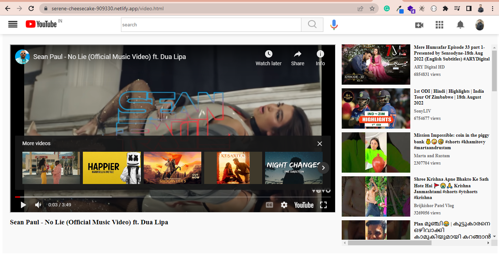

# YouTube-Clone
<h2>Its a mini project where I have fetched the YouTube data from Google API. Using advanced Html, CSS and JavaScript.</h2>

<h2>Here you can see the Home-Page of YouTube.</h2>

 

<h2>You can also search the any video whatever you want to see. in serach option you can see the debouncing feature.</h2>

<h2>you can watch the video without any ad interruption.</h2>
.

<h2>This YouTube will also recommend the videos.</h2>

